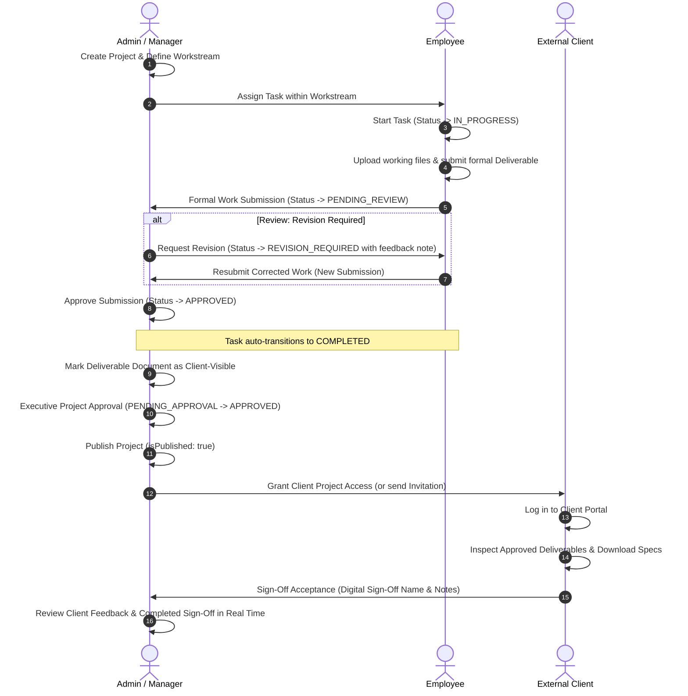

# SB Pvt. Ltd. — Enterprise Task & Workspace Management

> **Enterprise Platform for Multi-Tenant Task Management, Workstream Collaboration, Deliverable Submissions, and Client Portal Operations.**

---

## 1. Product Overview

**SB Pvt. Ltd. Enterprise Task & Workspace Management** is a full-stack, multi-tenant enterprise operating system designed to manage end-to-end task workflows, structured project workstreams, managerial reviews, formal deliverable submissions, and client-facing digital sign-offs.

The platform provides a strict separation between internal enterprise collaboration (employees, team leads, managers, administrators) and external stakeholders (clients). Internal teams plan, execute, review, and approve deliverables within dedicated workstreams. Upon executive publication, external clients gain access to a dedicated, security-isolated **Client Portal** to inspect approved deliverables, provide feedback, and execute digital sign-offs.

---

## 2. Core Architecture & Workflow Hierarchy

The system enforces a hierarchical operational model:

```
Organization (Multi-Tenant Boundary)
  └── Department (Functional Division)
        └── Project (Enterprise Initiative)
              ├── Project Members (RBAC: Admin, Manager, Lead, Member, Viewer)
              ├── Workstreams (Sub-team Work Containers)
              │     ├── Workstream Members & Leads
              │     └── Tasks (Granular Assignable Deliverables)
              │           ├── Task Comments & Attachments (Internal Scratchpad)
              │           └── Formal Work Submissions (Versioned Artifacts)
              │                 └── Managerial Review (Approve / Request Revision)
              ├── Project Health Metrics (Internal Schedule & SLA Tracking)
              ├── Project Approval Workflow (Submission → Executive Sign-Off)
              └── Project Publication (Gated Release to Client Portal)
                    └── Client Portal Access (Strictly Isolated Stakeholder View)
                          ├── Approved Deliverables & Documents (Client-Visible Only)
                          └── Client Acceptance (Digital Sign-Off / Revision Request)
```

---

## 3. Technology Stack

### Frontend
- **Framework & Runtime:** React 19 (`^19.2.8`), React DOM 19
- **Build Tool & Dev Server:** Vite 8 (`^8.2.2`)
- **Routing:** React Router DOM 7 (`^7.18.4`) with lazy loading and role-gated routes
- **Styling & Design System:** Tailwind CSS v4 (`^4.3.3`), `@tailwindcss/vite` plugin
- **Icons & Visualization:** Lucide React (`^1.47.0`), Recharts (`^3.10.1`)
- **HTTP Client:** Axios (`^1.20.0`) with request/response interceptors & token refresh
- **Code Quality:** Oxlint (`^1.79.0`)

### Backend
- **Runtime & Framework:** Node.js (v18+ / v20+), Express 5 (`^5.2.1`)
- **Database & ORM:** MySQL 8 (`mysql2 ^3.24.4`), Sequelize ORM (`^6.37.8`)
- **Authentication & Security:** JSON Web Tokens (`jsonwebtoken ^9.0.3`), bcryptjs (`^3.0.3`), Cookie-Parser (`^1.4.7`), Helmet (`^8.3.0`), CORS (`^2.8.6`), Express-Rate-Limit (`^8.7.0`)
- **Validation:** Joi (`^18.2.8`) schema validation on all inputs
- **File Uploads:** Multer (`^2.4.0`) with MIME/extension guards & unique stored naming
- **Logging & Config:** Morgan (`^1.12.0`), Dotenv (`^17.4.2`)
- **Development Tooling:** Nodemon (`^3.1.14`), Concurrently (`^10.0.5`)

---

## 4. Repository Structure

```
NexOps/
├── client/                     # Vite + React 19 Single Page Application
│   ├── public/                 # Static assets, SB Pvt. Ltd. logos and favicons
│   ├── scripts/                # Frontend test scripts (testAuthFlow, testStage6DataFlow)
│   ├── src/
│   │   ├── api/                # Axios client, interceptors, and modular endpoint wrappers
│   │   ├── components/         # Reusable design system UI, modals, widgets, tables
│   │   ├── constants/          # Routes, roles, API endpoints, branding tokens
│   │   ├── context/            # AuthContext (JWT state, session recovery, event dispatch)
│   │   ├── hooks/              # useAuth, useNotifications, useDebounce
│   │   ├── layouts/            # AppLayout (Internal), ClientLayout, AuthLayout, Sidebar, Navbar
│   │   ├── pages/              # Lazy-loaded page views (Dashboard, Tasks, Projects, Health, etc.)
│   │   ├── routes/             # Router config, ProtectedRoute, PublicRoute
│   │   └── utils/              # Storage, formatting, class merging (cn)
│   ├── index.html              # HTML shell with SB Pvt. Ltd. meta & fonts
│   ├── package.json            # Frontend package configuration
│   └── vite.config.js          # Vite bundler config with path aliases (@)
├── server/                     # Express 5 REST API & Sequelize Data Layer
│   ├── scripts/                # Database migrations, maintenance, and 14 automated test suites
│   ├── src/
│   │   ├── config/             # Database connection, env loader, Multer upload config
│   │   ├── constants/          # System enums (roles, task status, priority, permissions)
│   │   ├── controllers/        # Express HTTP request handlers (27 controllers)
│   │   ├── middleware/         # Auth, RBAC, blockClientRole, task ACL, rate limiting, errors
│   │   ├── models/             # Sequelize models & relational associations (24 models)
│   │   ├── routes/             # Express route declarations with validation middleware
│   │   ├── seed/               # Development seed script (organizations, users, projects)
│   │   ├── services/           # Core business logic layer (29 services)
│   │   ├── utils/              # Password hashing, JWT signing/verifying, user sanitizers
│   │   ├── validators/         # Joi validation schemas for all incoming payloads
│   │   ├── app.js              # Express application assembly and middleware mounting
│   │   └── server.js           # HTTP listener & background notification automation scheduler
│   └── package.json            # Backend package configuration
├── docs/                       # Architecture, security, workflow, and role specifications
├── package.json                # Root workspace orchestrator (runs client & server concurrently)
└── README.md                   # System documentation and operational manual
```

---

## 5. Prerequisites

Before running the application, ensure the following are installed:
- **Node.js:** `v18.x` or higher (`v20.x` LTS recommended)
- **npm:** `v9.x` or higher
- **MySQL:** `v8.0` or higher running locally or accessible via network

---

## 6. Installation & Setup

### Step 1: Clone the Repository
```bash
git clone https://github.com/biswassomnath854-glitch/NexOps.git
cd NexOps
```

### Step 2: Install Dependencies
Install all root, backend, and frontend dependencies:
```bash
# Install root orchestrator dependencies
npm install

# Install backend dependencies
cd server
npm install

# Install frontend dependencies
cd ../client
npm install

# Return to project root
cd ..
```

### Step 3: Configure Environment Variables

**Backend Environment (`server/.env`):**
Create `server/.env` by copying `server/.env.example`:
```bash
cp server/.env.example server/.env
```
Update database credentials and JWT secrets:
```ini
NODE_ENV=development
PORT=5000

DB_HOST=localhost
DB_PORT=3306
DB_NAME=nexops
DB_USER=root
DB_PASSWORD=YOUR_MYSQL_PASSWORD

JWT_ACCESS_SECRET=your_super_secret_jwt_access_key_min_32_characters_long
JWT_REFRESH_SECRET=your_super_secret_jwt_refresh_key_min_32_characters_long

CLIENT_URL=http://localhost:5173
```

**Frontend Environment (`client/.env`):**
Create `client/.env` by copying `client/.env.example`:
```bash
cp client/.env.example client/.env
```
Content:
```ini
VITE_API_BASE_URL=http://localhost:5000/api
```

---

## 7. Database Initialization & Migrations

### Step 1: Create MySQL Database
Using the MySQL CLI or management tool (e.g., MySQL Workbench):
```sql
CREATE DATABASE IF NOT EXISTS nexops CHARACTER SET utf8mb4 COLLATE utf8mb4_unicode_ci;
```

### Step 2: Run Database Schema Migrations
Execute the sequential migration scripts located in `server/scripts/` to create the client portal, audit logging, feedback, and invitation tables:
```bash
# Run from repository root
node server/scripts/migratePhase18ClientPortal.js
node server/scripts/migratePhase18_3AClientFeedback.js
node server/scripts/migratePhase18_3BClientPortalAudit.js
node server/scripts/migratePhase18_3CClientInvitations.js
```

### Step 3: Seed Initial Development Data
Populate the database with sample organizations, departments, demo users, projects, and workstreams:
```bash
npm run seed:development --prefix server
```

---

## 8. Development & Demo Accounts

> **Important:** The credentials below are **strictly for local development and testing purposes**. Never use these passwords in staging or production environments.

| Role | Demo Email | Demo Password | Primary Responsibilities |
| :--- | :--- | :--- | :--- |
| **SUPER_ADMIN** | `admin@nexops.local` | `NexOps@12345` | Global platform administration, organization management, all permissions |
| **ADMIN** | `admin@nexops.local` | `NexOps@12345` | Organization setup, user management, project publication |
| **MANAGER** | `manager@nexops.local` | `NexOps@12345` | Project leadership, workstream management, submission review & approval |
| **EMPLOYEE** | `employee@nexops.local` | `NexOps@12345` | Task execution, file uploads, formal deliverable submissions |
| **CLIENT** | Created via invitation | Set upon accept | External project stakeholder, deliverable inspection, digital sign-off |

---

## 9. Running the Application

### Concurrent Development Mode (Recommended)
Run both backend (port 5000) and frontend (port 5173) simultaneously from the project root:
```bash
npm run dev
```

### Starting Services Individually
- **Backend Only:**
  ```bash
  npm run dev:server
  # or: cd server && npm run dev
  ```
  The API will be available at `http://localhost:5000` (Health check: `http://localhost:5000/api/health`).

- **Frontend Only:**
  ```bash
  npm run dev:client
  # or: cd client && npm run dev
  ```
  The web interface will be accessible at `http://localhost:5173`.

---

## 10. Roles & Access Control Matrix

The platform implements seven discrete roles across internal operations and external stakeholders:

| Role | Organization Scope | Project / Task Access | Review & Approvals | Client Portal Access |
| :--- | :--- | :--- | :--- | :--- |
| **SUPER_ADMIN** | All organizations | Full read/write/delete across all entities | Full override authority | None (Internal workspace only) |
| **ADMIN** | Assigned organization | Full read/write/delete in organization | Submit & publish projects | None (Internal workspace only) |
| **MANAGER** | Assigned organization | Read/write in managed projects | Review & approve work submissions | None (Internal workspace only) |
| **TEAM_LEAD** | Assigned organization | Read/write in assigned workstreams | Review work submissions in lead workstream | None (Internal workspace only) |
| **EMPLOYEE** | Assigned organization | Assigned tasks & project documents | Upload files, submit formal deliverables | None (Internal workspace only) |
| **VIEWER** | Assigned organization | Read-only access to assigned projects | None (Cannot review or submit) | None (Internal workspace only) |
| **CLIENT** | Explicit Project Grants | **Only published projects granted to them** | Accept deliverables / request revisions | **Full Access to Client Portal** |

---

## 11. End-to-End Business Workflow

The system enforces a complete, audited business lifecycle:



### Distinction Between Attachments and Formal Submissions:
- **Task Attachments:** Ad-hoc working files uploaded during progress for scratchpad sharing and informal collaboration.
- **Formal Work Submissions:** Versioned, immutable deliverable snapshots submitted for formal managerial review. Submissions record reviewer feedback notes, approval/revision status, timestamps, and directly govern task completion.

---

## 12. Client Security Boundary & Data Isolation

The platform enforces strict physical and logical boundaries between internal enterprise users and external clients:

1. **API Layer (`blockClientRole`):**  
   All internal endpoints (`/api/tasks`, `/api/workstreams`, `/api/projects`, `/api/workload`, `/api/analytics`, `/api/project-health`, `/api/users`) are protected by the `blockClientRole` middleware. Any attempt by a `CLIENT` account to access internal endpoints immediately yields `403 Forbidden` (`CLIENT_WORKSPACE_ACCESS_DENIED`).
2. **Dedicated Client Namespace (`/api/client`):**  
   External stakeholders interact solely through `/api/client/projects`, which filters projects through active `ClientProjectAccess` records and verifies that the project is published (`isPublished = true`).
3. **Data Masking:**  
   Payloads returned to clients contain **zero internal workplace data**:
   - No employee lists or user profiles
   - No workstreams or internal task lists
   - No task comments or informal attachments
   - No workload or operational analytics
   - No internal deadlines or project health metrics
   - Only client-visible documents (`is_client_visible = true`)
4. **UI Isolation (`ProtectedRoute` & `ClientLayout`):**  
   Frontend routing automatically redirects `CLIENT` users to `/client/projects` and prevents internal users from entering the client layout.

---

## 13. Testing & Quality Assurance

The codebase includes an extensive suite of 14 automated integration and regression tests covering authentication, RBAC, multi-tenancy, file handling, client portal security, and the complete business lifecycle.

### Running Regression Suites
Run automated test suites from the repository root:
```bash
# 1. Run Complete 16-Step End-to-End Business Lifecycle Test
node server/scripts/testPhase20EndToEndWorkflow.js

# 2. Run System Hardening & RBAC Verification
node server/scripts/testPhase19Hardening.js

# 3. Run Client Portal UX & Document Visibility Verification
node server/scripts/testPhase18_4ClientPortalUx.js

# 4. Run Client Invitation & Onboarding Test
node server/scripts/testPhase18_3CClientInvitations.js

# 5. Run Client Portal Audit Logging Test
node server/scripts/testPhase18_3BClientPortalAudit.js

# 6. Run Client Feedback & Digital Sign-Off Test
node server/scripts/testPhase18_3AClientFeedback.js

# 7. Run Client Portal Security & Publication Gating
node server/scripts/testPhase18ClientPortal.js

# 8. Run Workstreams, Documents & Health Metrics Test
node server/scripts/testPhase17WorkstreamsDocumentsHealth.js

# 9. Run Data Integrity & Cascade Test
node server/scripts/testPhase14DataIntegrity.js

# 10. Run OWASP Security & Injection Test
node server/scripts/testStage9SecurityOwasp.js

# 11. Run Edge Cases & Error Handling Test
node server/scripts/testStage8EdgeCases.js

# 12. Run Database Models & Relational Associations Test
node server/scripts/testStage5DatabaseModels.js

# 13. Run API Validation & Cross-Tenant Data Isolation Test
node server/scripts/testStage4ApiValidation.js

# 14. Run Auth & RBAC Verification Test
node server/scripts/testStage3AuthRbac.js
```

### Running Frontend Validation
```bash
# Execute Oxlint static analysis (0 errors expected)
npm run lint --prefix client

# Execute production Vite build (0 errors expected)
npm run build --prefix client
```

---

## 14. Known Limitations & Operating Notes

- **Local Storage:** Uploaded task attachments and project documents are stored locally in the `uploads/` directory on the server filesystem. For enterprise clustering, an S3-compatible object store adapter would be recommended.
- **In-Memory Notification Scheduler:** The notification automation scheduler runs inside the Node.js process using recurring timers rather than a distributed message broker (e.g., Redis / BullMQ).
- **Single-Organization User Scope:** Standard users belong to one organization at a time; multi-organization tenant switching is restricted to `SUPER_ADMIN` accounts.
- **Environment Status:** Currently verified for local enterprise development, evaluation, and end-to-end integration testing. Not configured for containerized Kubernetes/Docker deployment.

---

## 15. License & Copyright

&copy; 2026 **SB Pvt. Ltd.** All rights reserved.  
Internal Enterprise Task & Workspace Management Platform.
